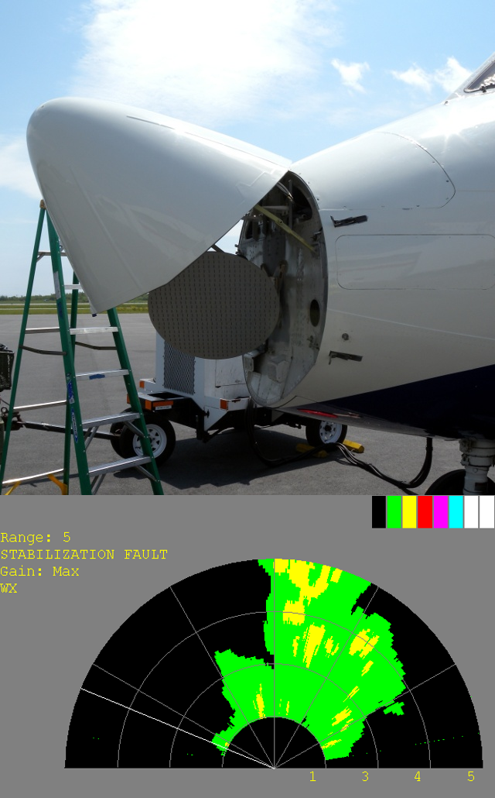

============
Introduction
============

The FAAM aircraft is equipped with a Honeywell RDR-4B X-band Doppler weather radar.
The radar is an aircraft system, used for weather detection and avoidance. 
While the radar is primarily used for weather detection, it may also be of interest to
scientists after the flight during data analysis. The radar
system has been extended to include the ability for mission scientists to view radar data
independently of the cockpit display.

   The Honeywell RDR-4B Doppler weather radar, and an example of the MS display.

Each scan provides 512 bins between the aircraft and the current range limit, categorized
using an integer code between 0 and 7, along with information such as tilt, scan angle,
range and gain. The radar data are stored as a binary file, which is then converted to
netCDF format for easier analysis, using this software. During the conversion, the
range, tilt, scan angle and gain are converted from bit represention to physical units.